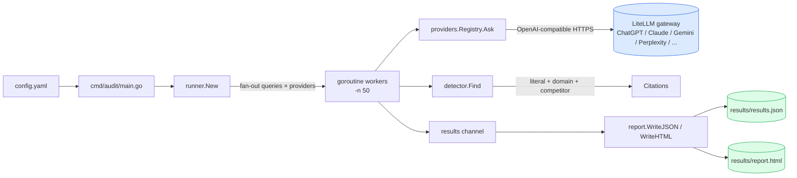
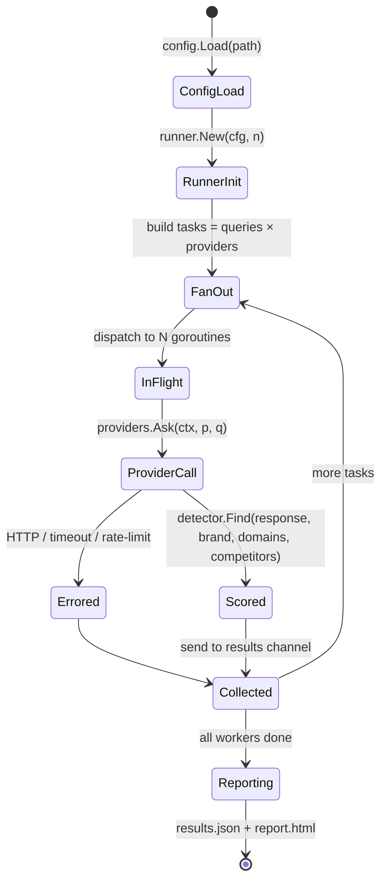
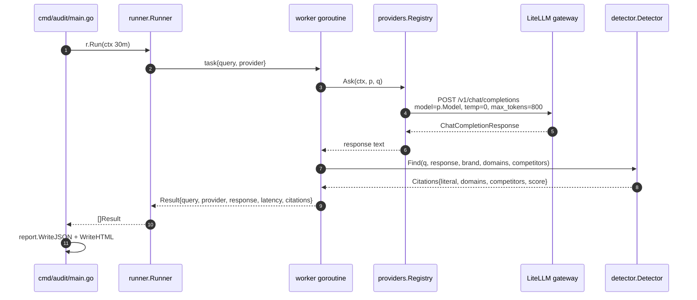

# geo-audit

[](https://pkg.go.dev/github.com/numoru-ia/geo-audit)
[](LICENSE)
[](https://go.dev)

> **Open-source Go CLI that audits how often your brand is cited across ChatGPT, Claude, Gemini, Perplexity (and any OpenAI-compatible LLM).** One YAML config, one binary, two reports (JSON + standalone HTML).

Companion articles: [GEO vs SEO — citaciones en LLMs](https://numoru.com/en/contributions/geo-vs-seo-citaciones-llms) · [Auditar si ChatGPT cita tu marca](https://numoru.com/en/contributions/auditoria-citaciones-llms-go).

---

## Why

SEO measured whether Google ranked your site. **GEO** (Generative Engine Optimization) measures whether *LLMs* mention your brand and domains when users ask vertical questions. Most tools that claim to measure this are closed SaaS dashboards. `geo-audit` is a tiny Go binary you run yourself:

- Point it at a YAML file listing your **brand**, **domains**, **competitors**, **queries**, and **providers**.
- Every `(query × provider)` pair is executed in parallel through **[LiteLLM](https://litellm.ai)** as the unified OpenAI-compatible gateway (one API surface, N model backends, one billing line).
- Responses are scanned for literal brand mentions, domain mentions, and competitor mentions.
- Output: `results/results.json` (machine-readable) + `results/report.html` (single-file shareable dashboard).

---

## Comparison

| Capability | `geo-audit` | Closed GEO SaaS | DIY Python notebook | Native SDKs per provider |
|---|---|---|---|---|
| Self-hosted, no data leaves your infra | ✅ | ❌ | ✅ | ✅ |
| Single binary (~15 MB) | ✅ | n/a | ❌ | ❌ |
| Parallel fan-out (`queries × providers`) | ✅ (50 workers default) | ✅ | depends | manual |
| Unified gateway (add a provider = one YAML line) | ✅ via LiteLLM | ✅ | ❌ | ❌ |
| Literal + domain + competitor detection | ✅ | ✅ | DIY | DIY |
| Semantic (paraphrased) citation detection | 🛣️ roadmap (Qdrant) | ✅ | DIY | DIY |
| Reproducible traces | 🛣️ roadmap (Langfuse) | ✅ | DIY | ❌ |
| Price for 50 queries × 5 providers | **~2 USD** (token passthrough) | 50–300 USD / mo | tokens only | tokens only |
| Open-source | ✅ Apache 2.0 | ❌ | ✅ | ✅ SDKs |

---

## Install

```bash
go install github.com/numoru-ia/geo-audit/cmd/audit@latest
# or
git clone https://github.com/numoru-ia/geo-audit.git
cd geo-audit && go build -o bin/audit ./cmd/audit
```

### Docker

```bash
docker build -t geo-audit .
docker run --rm -v "$PWD:/work" -e LITELLM_MASTER_KEY=sk-... geo-audit -c /work/config.yaml -out /work/results
```

---

## Quick start

```bash
cp config.example.yaml config.yaml      # edit brand, domains, competitors, queries
export LITELLM_MASTER_KEY=sk-...          # your LiteLLM proxy key
audit -c config.yaml -out results/ -n 50
open results/report.html
```

Full run defaults: **30 min context timeout**, **50 parallel workers**, **temperature 0**, **max 800 output tokens** per call.

---

## Architecture



### Audit run — state diagram



### Sequence — a single `(query × provider)` run



---

## Configuration (YAML)

See `config.example.yaml` for a full sample.

| Key | Type | Description |
|---|---|---|
| `brand` | string | Your brand name — matched literally (case-insensitive) in responses. |
| `domains` | `[]string` | Your owned domains — each is a separate hit in `domain_matches`. |
| `competitors[]` | list | `{brand, domains[]}` — competitor mentions tallied in `competitors_matched`. |
| `queries[]` | `[]string` | The prompts to send; one row per `(query × provider)` combination. |
| `providers[]` | list | `{id, model}` — e.g. `{id: claude, model: claude-sonnet}`. `model` is whatever LiteLLM knows. |
| `litellm_base_url` | string | Base URL of your LiteLLM proxy, e.g. `https://api.numoru.com/v1`. |
| `qdrant_url` | string | Reserved for semantic citation detection (roadmap). |
| `langfuse_url` | string | Reserved for trace export (roadmap). |

### CLI flags

| Flag | Default | Description |
|---|---|---|
| `-c` | `config.yaml` | Path to the YAML config |
| `-out` | `results` | Output directory (created if missing) |
| `-n` | `50` | Parallel workers |

### Env vars

| Env var | Required | Description |
|---|---|---|
| `LITELLM_MASTER_KEY` | ✅ | Master key for the LiteLLM proxy (read by `runner.New`) |

---

## Output schema (`results.json`)

```jsonc
[
  {
    "query": "Best AI observability tools 2026",
    "provider": "claude",
    "response": "…",
    "latency_ms": 1842000000,                // time.Duration ns
    "citations": {
      "literal_match": true,
      "domain_matches": ["numoru.com"],
      "semantic_match": false,               // roadmap
      "competitors_matched": ["Langfuse"],
      "score": 1.0                           // 0.6 literal + 0.4 domain
    }
  }
]
```

**Scoring model** (see `internal/detector/detector.go`): `score = 0.6·literal + 0.4·(domain_matches > 0)`. Adjust to taste — weights are tiny enough to tune in a fork.

---

## Project layout

```
cmd/audit/        main.go — entrypoint, flags, timeout
internal/
  config/         YAML loader (brand, queries, providers, endpoints)
  providers/      LiteLLM-backed OpenAI-compatible registry
  detector/       Literal + domain + competitor matcher
  runner/         Parallel fan-out over (queries × providers)
  report/         JSON + HTML writers
Dockerfile        multi-stage build
config.example.yaml
```

---

## Best practices

- **Pin model versions** in `providers[].model` — upstream weights change silently.
- **Keep queries intent-aligned**: ask the questions your buyers really ask, not brand-trivia questions.
- **Run weekly in CI** and diff the `results.json` across runs to spot ranking drift.
- **Use a dedicated LiteLLM virtual key per project** so costs and rate limits are isolated.
- **Scale `-n` to your LiteLLM proxy capacity**, not your laptop's cores — the bottleneck is the gateway.

---

## Roadmap

- [ ] **Semantic citation detection** using `qdrant_url` (embed responses, measure cosine similarity to canonical brand copy).
- [ ] **Langfuse export** so every `(query × provider)` becomes a reproducible trace.
- [ ] **Google AI Overview** adapter (non-OpenAI compatible).
- [ ] **Delta report** — compare run N vs run N-1 out of the box.
- [ ] **Exporters**: CSV, Parquet, DuckDB.

## Cost

Approximately **2 USD per full run** at 50 queries × 5 providers with default token budgets. Cost is pure LLM token passthrough — the tool itself is free.

## License

Apache 2.0 — see [LICENSE](LICENSE).
